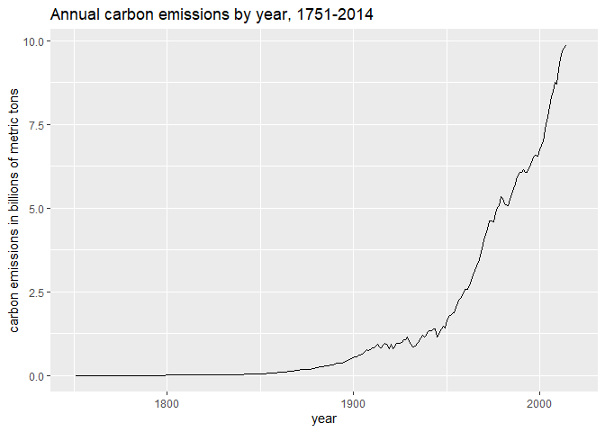
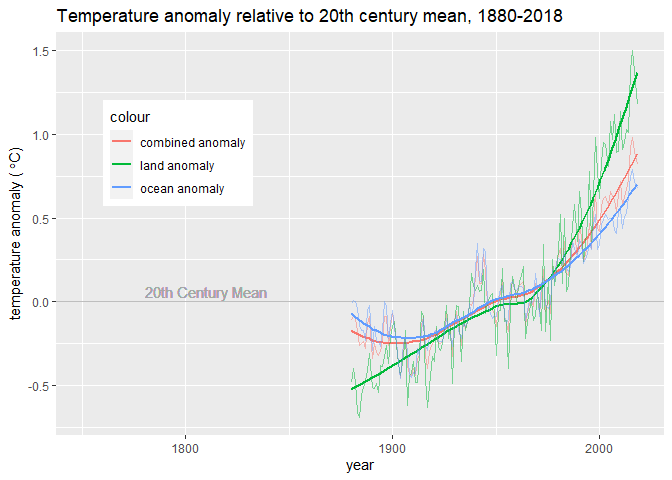
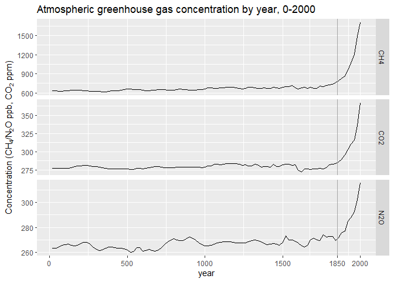
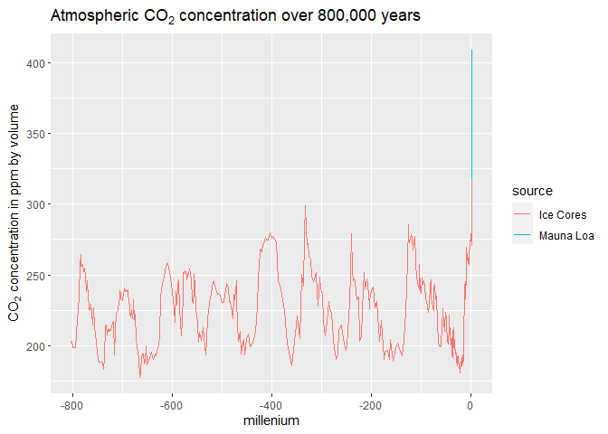
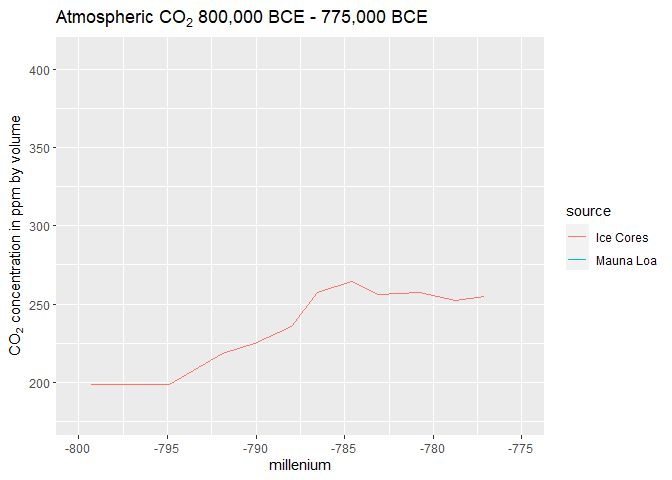
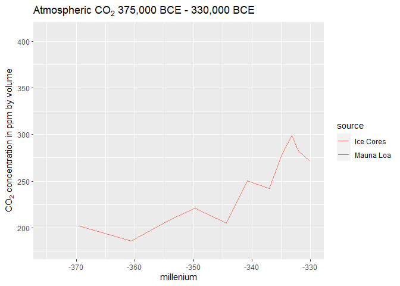
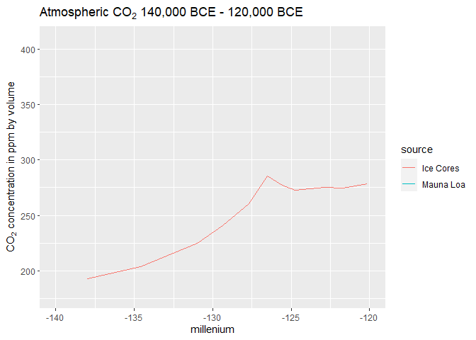
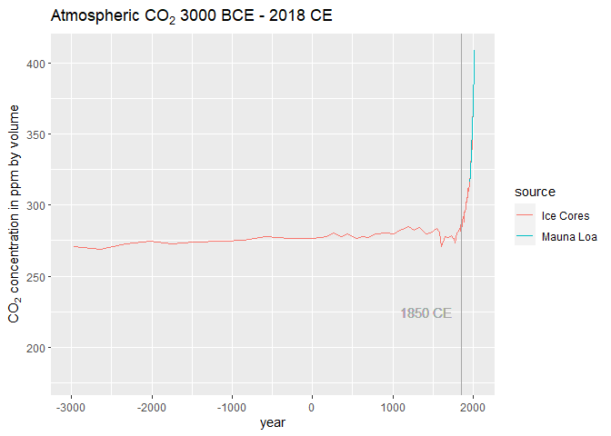

Report on Climate Change
================
Christopher Carbone
2/3/2021

## Introduction

This is a report on global climate change. First, we will examine carbon
emission rates since the beginning of the industrial revolution compared
with global temperature anomalies. Next, we will look at the atmospheric
concentrations of the 3 main greenhouse gases over the last millennium.
Finally, we will explore the historic levels of atmospheric
CO<sub>2</sub> over the last 800,000 years.

We will be using data sets loaded from the [dslabs
package](https://cran.r-project.org/web/packages/dslabs/dslabs.pdf).

We start by loading the necessary libraries:

``` r
library(tidyverse)
library(dslabs)
```

then loading the first data set:

``` r
data("temp_carbon")
```

## Carbon emissions and global temperature anomalies

Notice that after carbon emissions begin to rise at the end of the 19th
century, global temperature anomalies soon follow suit with an upward
trend:

<!-- --><!-- -->

-----

We load the next data set:

``` r
data("greenhouse_gases")
```

## Greenhouse gas concentrations

We see a relatively stable plateau spanning centuries leading up to an
exponential increase in atmospheric concentrations of CH<sub>4</sub>,
CO<sub>2</sub>, and N<sub>2</sub>O beginning in 1850, marking the start
of widespread fossil fuel consumption in the industrial revolution:

<!-- -->

-----

We load the final data set:

``` r
data("historic_co2")
```

## Historic CO<sub>2</sub> atmospheric concentration

We see natural cycles of CO<sub>2</sub> increase and decrease lasting
50,000 to 100,000 years per cycle, with the decrease happening more
slowly than the increase, and a sharp spike upward in recent history:

<!-- -->

Zooming in on the period around 790,000 years ago, we see that it took
roughly 10,000 years for CO<sub>2</sub> levels to rise from 200 ppmv to
its peak around 265 ppmv:

<!-- -->

Looking more closely at the period around 350,000 years ago, we see that
it took over 27,000 years for CO<sub>2</sub> levels to rise from 180
ppmv to 300 ppmv:

<!-- -->

We see in the period around 130,000 years ago that it took over 11,000
years for CO<sub>2</sub> levels to rise from 195 ppmv to 285 ppmv:

<!-- -->

Lastly, we see that in recent history, CO<sub>2</sub> levels held a
steady plateau for over 4,500 years before spiking from 275 ppmv to
almost 410 ppmv in the last 250 years or so, with a sharp upturn right
around 1850, once again coinciding with the start of widespread fossil
fuel consumption:

<!-- -->

-----

## Conclusion

The data depicts a strong correlation between rising carbon emissions,
atmospheric greenhouse gas levels, and global warming trends that
perfectly coincide with the rise of widespread fossil fuel consumption
around 1850 CE.

-----
